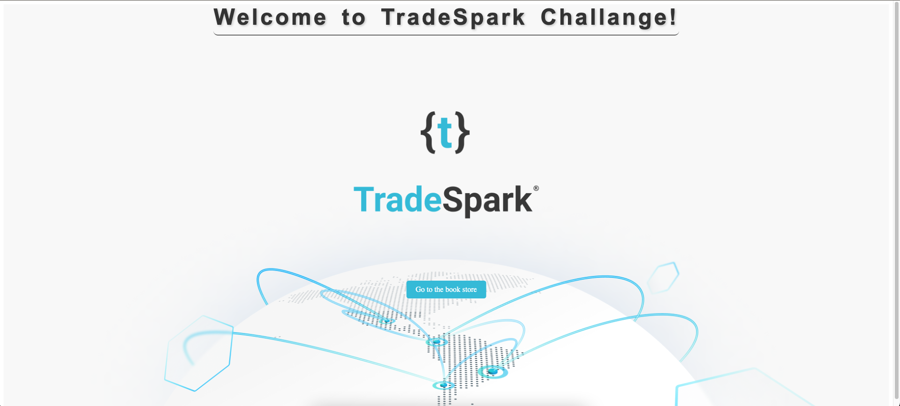

# TradeSparkChallange

## Getting started

### Prerequisites
Docker and docker-compose. for installation instructions see [here](https://docs.docker.com/install/)

#### Make sure that the docker daemon is running.

### Run the challange
1. Clone the repository
2. Run `docker-compose up` in the root directory of the repository
3. enter to localhost:4200 in your browser
4. Your has to see the following screen:

