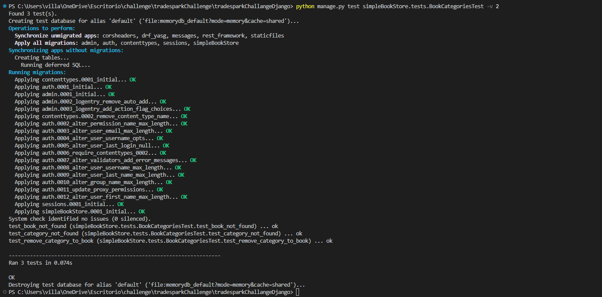
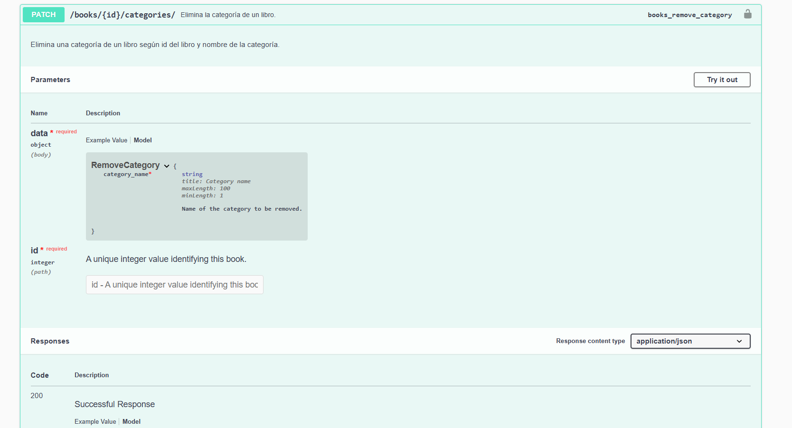

# TradeSparkChallange


## Getting started

### Prerequisites
Docker and docker-compose. for installation instructions see [here](https://docs.docker.com/install/)

#### Make sure that the docker daemon is running.


### Run the challange
1. Clone the repository
2. Run `docker-compose up` in the root directory of the repository
3. enter to localhost:4200 in your browser
4. Your has to see the following screen:


## Challenge resolution
Todo lo  implementado ha sido testeado unitariamente y documentado. Ir a la [sección de testing](#testing-unitario) para ver información sobre testing y a la [sección de documentación](#seccion-de-enlace) para ver la documentación generada.

### Requerimiento A
- Construir un filtro sobre la tabla en la sección "Book store", el cual sea capaz de filtrar por título, autor o categoría.

> Se agregó el componente ***app-search-bar*** el cual es un **input** que captura un **string** ingresado por el usuario y pasa su contenido al componente padre ***book-store*** a traves de una función callback.
>
>Cuando se detectan cambios en el input de ***app-search-bar***, se ejecuta la funcion ***onSearchChange()*** que  recibe por **parametro** el **string** ingresado y emite un evento que ejecuta la funcion ***onFilterChange*()** de ***book-store.component***. Esta ultima función ejecuta la funcion ***filterBooks()*** de ***book-store.service*** para buscar en una lista de libros consumida desde la **API**, algún libro que coincida con el **string** ingresado.
>
>
>
> - ***app-search-bar.component*** > ***book-store.component*** > ***book-store.service***
> 
>    - ✅ Aplica ***single responsability***.
>    - ✅  Componentes reutilizables y atómicos.

### Requerimiento B
- Dado el título de un libro y el nombre de una categoría, implementar la eliminación de esa categoría para el libro asociado.

> Para este endpoint se tomó la decisión de tomar como identificador unico del Libro su **id** y, para no perder el sentido del endpoint, la Categoria se puede eliminar (del Libro) por **nombre**. 
>
> Para poder eliminar la Categoria de un Libro por **nombre**, se ajustó el modelo perteneciente a las categorias marcando como **clave única** al nombre. Es algo coherente no tener categorias con el mismo nombre; no así los libros los cuales sí pueden tener el mismo titulo/nombre.
>
> - Se optó por un **endpoint** de tipo **PATCH** y **PUT**. Es decir, la funcion responde a solicitudes de este tipo. 
> - La funcion de respuesta fue agregada en el archivo **views.py** con el decorador **@action** .
> - **URL** : ***localhost:8000/bookStore/books/:id/categories/***  ---> tiene este formato porque se entiende a la lista de categorias como un **subrecurso** de un Libro, la cual unicamente puede ser agregada o quitada del Libro, pero no modificada.
> - El cuerpo de la solicitud debe contener el siguiente **json**, además del **id** del Libro en la URL:
>
>    ```json
>    {
>       "category_name": "Software"
>    }
>
> - **Para facilitar tests** con agregado y eliminacion de categorías, **el endpoint permite agregar y/o eliminar Categoria por nombre**. Si se le pasa el nombre de una categoria que el Libro no tiene la agrega, pero si la tiene la elimina. 


### Requerimiento C
- Implementar un botón en la sección book store que permite eliminar una categoría perteneciente a un libro. Este botón, al ser clickeado, deberá interactuar con el backend, el cual ejecutará la lógica implementada en el segundo punto para hacer efectiva la eliminación.

> Para modificar la forma de ver de las categorias en la tabla se creó el componente ***label-category***. Es un **div**, hijo de ***book-store*** , que contiene una etiqueta **p** y un **button** que permite capturar el evento click para quitar una Categoria del Libro.
>
>***label-category*** recibe por **parametro** un **id** que actúa como identificador unico de la etiqueta, un **textContent** que es el contenido de la etiqueta y una funcion callback para pasar a su padre un **objeto** que contiene la informacion del Libro y la Categoria de este tipo:
>   ```json
>       {
>           "id": "1",
>           "category":"software"
>       }
> ```
> **id** es el identificador del Libro y **category** es el nombre de la Categoria. Uno es el identificador de la ***label-category*** (id) y el otro es el **textContent** en el cual se visualiza el nombre de la Categoria.
>
>Cuando el **button** de ***label-category*** recibe un click, se ejecuta la función ***handleOnClick()*** la cual emite un evento para ejecutar la funcion ***handleClickLabel()*** de ***book-store.component***, la cual por parámetros recibe el **objeto** con la información y ejecuta la funcion ***updateCategories()*** de ***book-store.service*** para mandar a la **API** el nombre de la Categoria a remover y el id del Libro.
>
> - ***app-label-category.component*** > ***book-store.component*** > ***book-store.service***
> 
>    - ✅ Aplica ***single responsability***.
>    - ✅  Componentes reutilizables y atómicos.

------------------------------------------------------------------------------------------------------------------------------------------------------------------------------------

## Testing y docs.
Para el **proyecto angular** se utilizaron los frameworks y herramientas:
- **Jest.js** ---> Para testing unitario de componentes y servicios. Docs.: [Jest](https://jestjs.io/docs/getting-started).
- **CompoDoc** ---> Para generación de documentación para desarrolladores a traves de comentarios en código. Docs.: [Compodoc](https://compodoc.app/guides/getting-started.html).

Para el **proyecto django** se utilizaron los frameworks:
- **Rest framework test** --> Para testing unitario de la funcion de entrada al servicio desarrollado. Docs.: [Django rest](https://www.django-rest-framework.org/api-guide/testing/).
- **Swagger** --> Para generación de detalles y ejecución de pruebas a los endpoint que contiene el proyecto. Docs.: [Swagger](https://www.swagger.io/).
### Testing unitario 
---------------------------------------------------------------------------------------------------------------------------------------------------------------------------------------
#### Angular
>- Descomentar el archivo **setup.jest.js** y los archivos **.spec** que se quieran ejecutar.
>- Ejecutar en la raiz del proyecto `npm run test` en bash.


>Se hicieron pruebas sobre la totalidad de los componentes y servicios afectados por la implementacion del challenge y los resultados fueron exitosos. Ver archivos de testing **.spec** para entender las pruebas. El unico componente que no se testeo fue ***main-page*** por no estar afectada en la implementacion. Al ejecutar el comando `npm run test` y descomentando los archivos **.spec** y **setup.jest** se obtienen los resultados: 


#### Django
>- Ejecutar en la raiz del proyecto: `python manage.py test simpleBookStore.test.BookCategoriesTest` en la linea de comandos.


> Se hicieron pruebas a la funcion creada para la implementacion del endpoint del Requerimiento B y los resultados fueron exitosos. Ver archivo de testing **tests.py** para mayor detalle de las pruebas. Al ejecutar el comando de testing, se obtienen estos resultados: 



### Documentación
---------------------------------------------------------------------------------------------------------------------------------------------------------------------------------------
#### Angular
>- Ejecutar en la raiz del proyecto `npm run compodoc` en bash.


>Al ejecutar el comando se abrirá una pantalla en la que se puede navegar fácilmente y ver todo tipo de información sobre componentes y servicios. Mucha de la informacion especifica que se muestra está creada con los **comentarios en los archivos y metodos**. Esta captura muestra como está compuesto el ***book-store.component*** en el DOM:


#### Django
>- Una vez levantada la API abrir en browser el endpoint **localhost:8000/swagger/**.
>- Funciona como un endpoint mas de la API.


> Una vez solicitado el endpoint **localhost:8000/swagger** se abrirá una pantalla donde se pueden ver todos los endpoints, filtrarlos y ejecutarlos. Esta imagen muestra información del endpoint desarrollado:



### Otros recursos
---------------------------------------------------------------------------------------------------------------------------------------------------------------------------------------
#### Clases de los componentes y servicios de Angular creados.


---------------------------------------------------------------------------------------------------------------------------------------------------------------------------------------
#### Capturas hechas al Front-end.

Del requerimiento de filtrado:


Del requerimiento de remover categoria:


